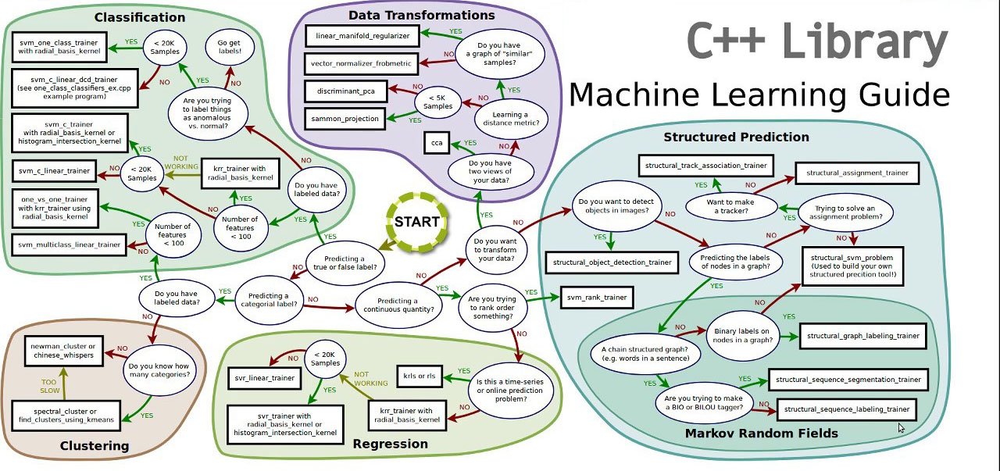

#  <p align=center> <b>Hello, I'm Sergey</b>     :raising_hand: </p>

##  <p align=center> <b>CHALLENGE FOR ME:</b><br/> I have to study JAVA (Basics) in 7 days before the Java Enterprise course starts<br/> *(Start 08-sep-2021 after signing the contract)*</p> 


#  LEARN JAVA (BASICS)<br/> TASK LIST:

- [X] **001 SETUP ENVIRONMENT**:
   - [X] Java Virtual Machine
   - [X] Intellij IDEA
   - [X] Eclipse *(Installed but I don't use this)*
   - [X] **RESULT:** Application [*001_JHelloWorld_*][1]
- [ ] **002 STUDY AND PRACTICE (S&P)**: (Deadline: 13-sep-2021)
   - [X] .1 Datatypes
   - [X] .1 Variables
   - [X] .1 Loops
   - [ ] .1 Arrays
   - [X] .1 Operators
   - [X] .1 if/switch operators
   - [ ] **RESULT:** Application [*002.1_JDVLAOIS_*][2]
   - [ ] .2 Generic and Enumeration (enum)
   - [ ] **RESULT:** Application [*002.2_JGenericEnum_*][3]
   - [ ] .3 String
   - [ ] .3 Regular Expressions
   - [ ] **RESULT:** Application [*002.3_JStringRegExp_*][4]
   - [ ] .4 Exceptions
   - [ ] **RESULT:**: Application [*002.4_JExceptions_*][5]
   - [ ] .5 File handling
   - [ ] **RESULT:** Application [*002.5_JFileHandling_*][6]
- [ ] **003 COLLECTIONS**:  (Deadline: 13-sep-2021)
   - [ ] .1 List
   - [ ] **RESULT:** Application [*003.1_JList_*][7]
   - [ ] .2 Set
   - [ ] **RESULT:** Application [*003.2_JSet_*][8]
   - [ ] .3 Map
   - [ ] **RESULT:** Application [*003.3_JMap_*][9]
- [ ] **004 OBJECT ORIENTED PROGRAMMING (OOP)**:  (Deadline: 14-sep-2021)
   - [ ] .1 Classes and Objects
   - [ ] .1 Inheritance & Polymorphism
   - [ ] **RESULT:** Application [*004.1_JCOIP_*][10]
   - [ ] .2 Anonymous classes
   - [ ] **RESULT:** Application [*004.2_JAnonymous_*][11]
- [ ] **005 THREAD CLASS**:  (Deadline: 14-sep-2021)
   - [ ] .1 Runnable Interface
   - [ ] .1 Interaction of thread
   - [ ] .1 Producer-Customer
   - [ ] **RESULT:** Application [*005.1_JRunIPC_*][12]
   - [ ] .2 Thread pools
   - [ ] **RESULT:** Application [*005.2_JThreadPool_*][13]
   - [ ] .3 Asynchronous computation
   - [ ] **RESULT:** Application [*005.3_JAsyncThread_*][14]
- [ ] **006 APIs**:  (Deadline: 15-sep-2021)
   - [ ] .1 Lambda
   - [ ] **RESULT:** Application [*006.1_JLambda_*][15]
   - [ ] .2 Stream API
   - [ ] **RESULT:** Application [*006.2_JStreamAPI_*][16]
   - [ ] .3 Data Time API
   - [ ] **RESULT:** Application [*006.3_JDataTimeAPI_*][17]
   - [ ] .4 Reflection API
   - [ ] **RESULT:** Application [*006.4_JReflectionAPI_*][18]
- [ ] **007 DESIGN PRINCIPLES**:  (Deadline: 16-sep-2021)
   - [ ] .1 Pattern Singleton
   - [ ] **RESULT:** Application [*007.1_JPSingleton_*][19]
   - [ ] .2 Pattern DAO
   - [ ] **RESULT:** Application [*007.2_JPatternDAO_*][20]
   - [ ] .3 Pattern Front-controller
   - [ ] **RESULT:** Application [*007.3_JPFrontControl_*][21]
   - [ ] .4 Pattern Factory
   - [ ] **RESULT:** Application [*007.4_JPFactory_*][22]
   - [ ] .5 Pattern Command
   - [ ] **RESULT:** Application [*007.5_JPCommand_*][23]
   - [ ] Software
   - [ ] SOLID

## *NOTE:* To save time, projects will be done after writing ReadMe, because they already contain all the necessary code. It help to create a project on any topic very quickly if I have a well-described ReadMe file.

[1]: https://github.com/yoricsv/001_JHelloWorld_.git
[2]: https://github.com/yoricsv/002.1_JDVLAOIS_.git
[3]: https://github.com/yoricsv/002.2_JGenericEnum_.git
[4]: https://github.com/yoricsv/002.3_JStringRegExp_.git
[5]: https://github.com/yoricsv/002.4_JExceptions_.git
[6]: https://github.com/yoricsv/002.5_JFileHandling_.git
[7]: https://github.com/yoricsv/003.1_JList_.git
[8]: https://github.com/yoricsv/003.2_JSet_.git
[9]: https://github.com/yoricsv/003.3_JMap_.git
[10]: https://github.com/yoricsv/004.1_JCOIP_.git
[11]: https://github.com/yoricsv/004.2_JAnonymous_.git
[12]: https://github.com/yoricsv/005.1_JRunIPC_.git
[13]: https://github.com/yoricsv/005.2_JThreadPool_.git
[14]: https://github.com/yoricsv/005.3_JAsyncThread_.git
[15]: https://github.com/yoricsv/006.1_JLambda_.git
[16]: https://github.com/yoricsv/006.2_JStreamAPI_.git
[17]: https://github.com/yoricsv/006.3_JDataTimeAPI_.git
[18]: https://github.com/yoricsv/006.4_JReflectionAPI_.git
[19]: https://github.com/yoricsv/007.1_JPSingleton_.git
[20]: https://github.com/yoricsv/007.2_JPatternDAO_.git
[21]: https://github.com/yoricsv/007.3_JPFrontControl_.git
[22]: https://github.com/yoricsv/007.4_JPFactory_.git
[23]: https://github.com/yoricsv/007.5_JPCommand_.git

---

# The program of the course "TECHNOLOGIES FOR DEVELOPING ENTERPRISE SOLUTIONS IN JAVA" *(Start 16-sep-2021)*:

- [ ] **001 APACHE MAVEN (BASE)**:
   - [ ] Configuring Maven for Windows
   - [ ] Create a new project
   - [ ] Compiling and Testing
   - [ ] Project Object Model (POM)
   - [ ] Life Cycle
   - [ ] Build Profiles
- [ ] **002 MAVEN DEVELOPING TECHNIQUES**:
   - [ ] Build automation
   - [ ] Modularity of the project
   - [ ] Dependency management
   - [ ] Project installation automation
   - [ ] Building a web application
- [ ] **003 THE WEB**:
   - [ ] HTTP Protocol
- [ ] **005 Data transfer by HTTP**:
   - [ ] Java Servlet
   - [ ] Servlet Filters
- [ ] **004 APACHE TOMCAT SERVER**:
   - [ ] Tomcat architecture
   - [ ] Executing Tomcat server scripts
   - [ ] Passing runtime configuration options to Catalina scripts
   - [ ] Configuring the Tomcat server
   - [ ] Host configuration
   - [ ] Contexts configuration
   - [ ] Tomcat Web Application manager (WAM)
   - [ ] Gaining access to the WAM
   - [ ] Access to the WAM by the web interface
   - [ ] Tomcat Maven plugin
- [ ] **006 JAVA SERVER PAGES (JSP)**:
- [ ] **007 STANDARD TAG LIBRARY (JSTL)**:
- [ ] **008 GIT BASICS**:
   - [X] Concepts of version control
   - [X] Getting an account at [*my_account*][30]
   - [X] Installing the Git client
   - [X] Create a local repository linked to a remote repository
   - [X] Making your changes to the repository
   - [X] Uploading local changes to a remote repository
   - [X] Rollback changes in working copy
   - [X] Basic and advanced Git commands
- [ ] **009 DATABASES AND SQL**:
   - [ ] 010 Normalization
   - [ ] 010 Groupings
   - [ ] 010 Joins
   - [ ] 011 Java Database Connectivity (JDBC)
- [ ] **012 PATTERN DAO**:
   - [ ] Practice
- [ ] **013 HIBERNATE**:
   - [ ] Mechanism of data persistence
   - [ ] Object-relational model (OR-model)
   - [ ] Hibernate application
   - [ ] Hibernate architecture
- [ ] **014 HIBERNATE OBJECTS**:
   - [ ] The state of Hibernate objects in the lifecycle 
   - [ ] Data operations in Hibernate
   - [ ] Loading, Saving, Updating and Removing objects
   - [ ] The priority of flush operations
- [ ] **015 DISPLAYING AN OBJECT-RELATIONAL MODEL (OR-MODEL)**:
   - [ ] Entity declaration
   - [ ] Declaring the mapping of entity fields
   - [ ] Naming of tables and fields
   - [ ] Understanding identity
   - [ ] Component and entity concept
- [ ] **016 Displaying the class hierarchy**
   - [ ] Displaying heirs
   - [ ] Relationship mapping
   - [ ] Hibernate @OneToOne annotation
   - [ ] Hibernate @OneToMany annotation
   - [ ] Hibernate @ManyToMany annotation
   - [ ] Cascading operations in a relationship
   - [ ] HQL / JPQL: Object Oriented Query Language
   - [ ] Description and structure of the HQL / JPQL language
   - [ ] HQL / JPQL operations
   - [ ] Named queries
- [ ] CRITERIA JPA REQUESTS:
   - [ ] Description of the Criteria instance structure
   - [ ] Selection limiting operations
   - [ ] Projections and Aggregation in Criteria
   - [ ] Joins
   - [ ] Detached Queries
- [ ] TRANSACTIONS AND CONCURRENCY:
   - [ ] Using transactions
   - [ ] Transaction isolation levels
   - [ ] Setting the transaction isolation level
   - [ ] Pessimistic and optimistic locks, versioning
   - [ ] Distributed transactions
   - [ ] Session detailing
   - [ ] Configuring the second level cache
- [ ] SPRING:
   - [ ] Description of the dependency injection mechanism
   - [ ] Description of Spring modules
   - [ ] Spring containers
   - [ ] Spring bean life cycle
   - [ ] Description of links between beans
   - [ ] Bean declaration
   - [ ] Introduction to the property of beans
   - [ ] Description of SpEL expression language
   - [ ] Minimizing XML Configuration in Spring
   - [ ] Automatic linkage between beans
   - [ ] Relationship with annotations
   - [ ] Automatic bin detection
- [ ] ASPECT ORIENTED PROGRAMMING IN SPRING:
   - [ ] Configuration of aspects in the context of the application
   - [ ] Configuration of aspects via annotations.
- [ ] INTEGRATION OF HIBERNATE AND SPRING:
   - [ ] Hibernate entity manager factory declaration
   - [ ] Description of the configuration
- [ ] TRANSACTION MANAGEMENT:
   - [ ] Spring transactions
   - [ ] Spring software transactions
   - [ ] Spring declarative transactions
- [ ] SPRING DATA COMPONENT:
   - [ ] Repository interface
   - [ ] CRUD Repository interface (basic CrudRepository functionality, using conditions and expressions in queries)
   - [ ] JPA Repository interface (using @ Query-annotated queries)
   - [ ] Pagination and sorting of queries
   - [ ] Sample requests
- [ ] SPRING MVC COMPONENT:
   - [ ] MVC
   - [ ] Basic controller implementation
   - [ ] Processing controller parameters
   - [ ] Form processing
- [ ] SPRING REST:
   - [ ] Features
   - [ ] Annotations
- [ ] SPRING SECURITY:
   - [ ] Spring Security Module
   - [ ] Security methods
   - [ ] Web request security
   - [ ] User authentication
- [ ] Spring Boot:
   - [ ] Components
   - [ ] Launching a web application
   - [ ] Integration with Spring-data
   - [ ] Overriding system variables.
- [ ] FINAL PROJECT:
   - [ ] RESULT: [*001_JHelloWorld_*][31] Application

[30]: https://github.com/yoricsv
[31]: https://github.com/yoricsv

---

<!--## <p align=center> Thanks for your interest :thumbsup:     </p>-->

---


<!-- I am interested in working with embedded systems based on ARM-Cortex (for example: STMicroelectronics microcontrollers),
in addition, since childhood, I was really interested in electronics. I designed and assembled simple electronic devices,
but I didn't have enough tools and sources of components (few electronic stores). First of all, in my environment there
was no one who would be interested in this, like me. Now I am studying programming in C, C++, C# and it's really cool.
In the near future I want to learn Java, Python for AI.   

- I am currently learning C, C++ and sometimes spend a little time learning C#.

- I'm looking for someone who understands that he might get a good software engineer in the future.
-->
### How to reach me:
**Way**        | **link**
---:           | :---
LinkedIn:      | [go to LinkedIn](https://www.linkedin.com/in/yoric)
Microsoft:     | [go to microsoft](https://docs.microsoft.com/en-us/users/yoric/)
StackOverflow: | [go to profile](https://stackoverflow.com/users/16232348/sergey-selivonchyk)
HH:            | [go to HH profile](https://rabota.by/resume/3ed3914fff09156f230039ed1f6f526c467770)
email:         | yoricsv@yandex.ru
mobile:        | +375(29) 263-99-00


<!---
# MY TASKS LIST

- [ ] For compiling SFML on Linux I need to be install next packages:
   - [X] FreeType Engine (*TrueType font rendering engine*) [- download package][1]
   - [X] x11
      (*use following to install the package*) [- download package][2]
      ```bash
      sudo dnf install xorg-x11-apps      
      ```
      or 
      ```bash
      sudo dnf install @base-x      
      ```
      - [*System X Windows Manual*][3]
      - [*Configuring X Windows System*][4]
   - [X] XRandR (*configuration utility X Window System*) [- download package][5]
   - [X] Udev (*creates and removes device nodes*) [- download package][6]
   - [X] OpenGL (*API for rendering 2D and 3D vector graphics*) [- download package][7]
   - [X] OpenAL (*API for rendering of multichannel audio*) [- download package][8]
   - [X] FLAC (*Free Lossless Audio Codec*) [- download package][9]
   - [X] Ogg (*streaming and multimedia processing format*) [- download package][10]
   - [X] Vorbis (*audio encoding format*) [- download package][11]
   - [X] VorbisEnc (*encoder of raw float audio into a Vorbis stream*) [- download package][12]
   - [X] VorbisFile (*API for decoding audio streams*) [- download package][13]
   - [X] PThread (*POSIX Threads is a parallel execution model*) [- download package][14]


:warning:After installed those packages, don't forget to install their *Development Headers*:warning:

[1]: https://rpmfind.net/linux/fedora/linux/releases/34/Everything/x86_64/os/Packages/f/freetype-2.10.4-3.fc34.i686.rpm
[2]: https://rpmfind.net/linux/fedora/linux/releases/34/Everything/x86_64/os/Packages/l/libX11-1.7.0-3.fc34.x86_64.rpm
[3]: https://docs.fedoraproject.org/ru-RU/Fedora_Core/5/html/Release_Notes/sn-Xorg.html
[4]: https://docs.fedoraproject.org/en-US/quick-docs/configuring-x-window-system-using-the-xorg-conf-file/
[5]: https://fedora.pkgs.org/34/fedora-x86_64/libXrandr-devel-1.5.2-6.fc34.x86_64.rpm.html
[6]: https://rpmfind.net/linux/fedora/linux/updates/34/Everything/x86_64/Packages/s/systemd-udev-248.3-1.fc34.x86_64.rpm
[7]: https://rpmfind.net/linux/fedora/linux/releases/33/Everything/x86_64/os/Packages/l/libglvnd-opengl-1.3.2-2.fc33.x86_64.rpm
[8]: https://rpmfind.net/linux/fedora/linux/releases/34/Everything/x86_64/os/Packages/o/openal-soft-1.19.1-12.fc34.x86_64.rpm
[9]: https://rpmfind.net/linux/fedora/linux/releases/34/Everything/x86_64/os/Packages/f/flac-1.3.3-7.fc34.x86_64.rpm
[10]: https://rpmfind.net/linux/fedora/linux/releases/34/Everything/x86_64/os/Packages/l/libogg-1.3.4-4.fc34.x86_64.rpm
[11]: https://rpmfind.net/linux/fedora/linux/releases/34/Everything/x86_64/os/Packages/v/vorbis-tools-1.4.2-2.fc34.x86_64.rpm
[12]: https://fedora.pkgs.org/34/fedora-x86_64/libvorbis-devel-1.3.7-3.fc34.x86_64.rpm.html
[13]: https://fedora.pkgs.org/34/fedora-x86_64/libvorbis-devel-1.3.7-3.fc34.x86_64.rpm.html
[14]: https://rpmfind.net/linux/fedora/linux/releases/34/Everything/x86_64/os/Packages/g/glibc-2.33-5.fc34.x86_64.rpm

- [X] Develop common layout for README.md !!!!!!!!!!
- [ ] Check source code and remove unusable comments
- [ ] Refactoring code

---
<br/-->

[](https://github.com/anuraghazra/github-readme-stats)

 ## LOCAL PROJECT STRUCTURE (as a reminder) 
```
[<Project_name>]
  |
  |->[.build]           // directory for building system
  |     |               // all necessary directories and files
  |     |->[CMakeFiles] // for CMake build generator
  |
  |->[.git]             // all necessary directories and files
  |                     // for Git
  |
  |->[.settings]        // contains project file directories for
  |                     // different IDEs
  |
  |->[debug]            // contains compiller, linker, object
  |     |               // files
  |     |->[logs]       // contains logs
  |
  |->[<Project_name Repository>]
  |     |
  |     |->[inc]        // contains public/private HEADERS (*.h) 
  |     |->[res]        // contains static/dynamic LIBRARIES
  |     |               // (might be split into two directories
  |     |               // static and dynamic)
  |     |->[src]        // contains SOURCE files/code(s)(.с;.cpp)
  |     |
  |     |->[ui]         // these directories for applications
  |                     // with USER INTERFACE
  |
  |->[output]           // directory for executable applications
  |
  |->[tests]            // directory for unit tests
  |
  |-----> .gitignore
  |
  |-----> CMakeLists.txt
  |
  |-----> README.md
```
  
