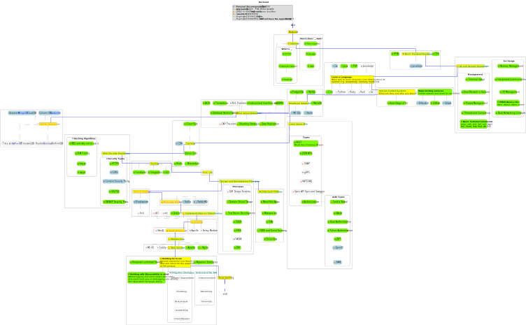
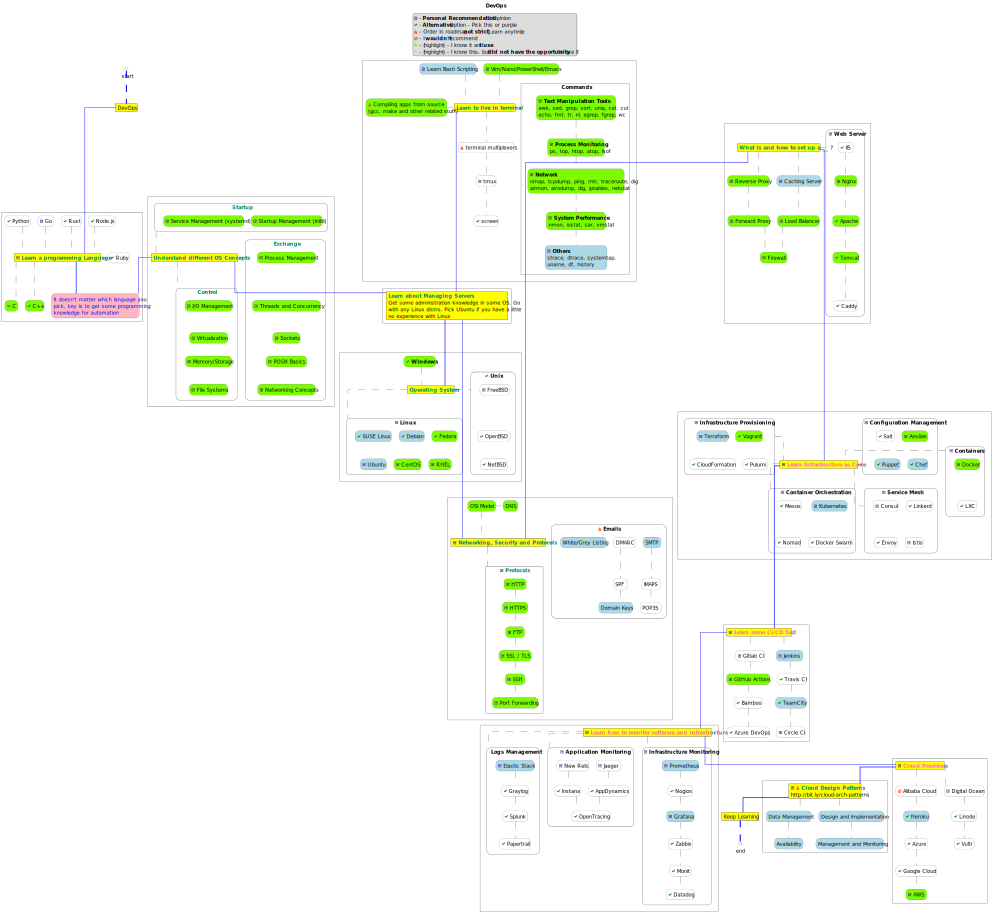

# __<https://github.com/yoricsv>__

[](https://github.com/anuraghazra/github-readme-stats)

## How to reach me

Way        | link
---:           | :---
LinkedIn:      | [go to LinkedIn](https://www.linkedin.com/in/yoric)
Microsoft:     | [go to microsoft](https://docs.microsoft.com/en-us/users/yoric/)
StackOverflow: | [go to profile](https://stackoverflow.com/users/16232348/sergey-selivonchyk)
HH:            | [go to HH profile](https://rabota.by/resume/3ed3914fff09156f230039ed1f6f526c467770)
email:         | <yoricsv@yandex.ru>
mobile:        | +375(29) 263-99-00

---

### [LEARN WEB APPLICATION SECURITY TESTING][wast]

> __NOTE:__ "WEB APPLICATION SECURITY TESTING COURSE" *(Start 11-dec-2023)*

[wast]: https://github.com/yoricsv/PenTestCourse.git

---

## My Hard Skills Roadmaps

> __NOTE:__
>
> *PlantUML Sources (.puml) for everyone:*
>
> - Frontend Roadmap  ([*Download*][pumlF])
> - Backend Roadmap ([*Download*][pumlB])
> - DevOps Roadmap ([*Download*][pumlD])

[pumlF]: https://github.com/yoricsv/yoricsv/blob/master/yoricsv/read/diagrams/src/hard_skills_devops.puml
[pumlB]: https://github.com/yoricsv/yoricsv/blob/master/yoricsv/read/diagrams/src/hard_skills_back.puml
[pumlD]: https://github.com/yoricsv/yoricsv/blob/master/yoricsv/read/diagrams/src/hard_skills_front.puml

- Frontend

  

- Backend

  

- DevOps

  

### [LEARN C++ (GAME DEVELOPMENT)][gameDev]

> __NOTE:__ "C++ GAME DEVELOPMENT PROFFESSIONAL" *(Start 10-nov-2021)*

[gameDev]: https://github.com/yoricsv/_CPP_GAME_DEVELOPMENT_.git

---

### [LEARN JAVA (ENTERPRISE EDITION)][javaEE]

> __NOTE:__ "TECHNOLOGIES FOR DEVELOPING ENTERPRISE SOLUTIONS IN JAVA" *(Start 16-sep-2021)*

[javaEE]: https://github.com/yoricsv/_JAVA_ENTERPRISE-EDITION_.git

---

### [LEARN JAVA (BASICS)][javaTaskList]

> __NOTE:__  Learn Java (basics) in 7 days it was a challenge for me *(Start 08-sep-2021 deadline 16-sep-2021)*. - __Couldn't finish on time__

---

## LEARN C++ (BASICS)
<!-- # [LEARN C++ (BASICS)][javaTaskList] -->

> __NOTE:__  I didn't know anything about Git until the last few lectures. Of course I couldn't add my projects *(Start 05-dec-2020 finish 10-mar-2021)*


[javaTaskList]: https://github.com/yoricsv/001_JavaBasics_.git

---

<!---
# TASKS LIST

- [ ] For compiling SFML on Linux I need to be install next packages:
   - [X] FreeType Engine (*TrueType font rendering engine*) [- download package][1]
   - [X] x11
      (*use following to install the package*) [- download package][2]
      ```bash
      sudo dnf install xorg-x11-apps      
      ```
      or 
      ```bash
      sudo dnf install @base-x      
      ```
      - [*System X Windows Manual*][3]
      - [*Configuring X Windows System*][4]
   - [X] XRandR (*configuration utility X Window System*) [- download package][5]
   - [X] Udev (*creates and removes device nodes*) [- download package][6]
   - [X] OpenGL (*API for rendering 2D and 3D vector graphics*) [- download package][7]
   - [X] OpenAL (*API for rendering of multichannel audio*) [- download package][8]
   - [X] FLAC (*Free Lossless Audio Codec*) [- download package][9]
   - [X] Ogg (*streaming and multimedia processing format*) [- download package][10]
   - [X] Vorbis (*audio encoding format*) [- download package][11]
   - [X] VorbisEnc (*encoder of raw float audio into a Vorbis stream*) [- download package][12]
   - [X] VorbisFile (*API for decoding audio streams*) [- download package][13]
   - [X] PThread (*POSIX Threads is a parallel execution model*) [- download package][14]

:warning:After installed those packages, don't forget to install their *Development Headers*:warning:

[1]: https://rpmfind.net/linux/fedora/linux/releases/34/Everything/x86_64/os/Packages/f/freetype-2.10.4-3.fc34.i686.rpm
[2]: https://rpmfind.net/linux/fedora/linux/releases/34/Everything/x86_64/os/Packages/l/libX11-1.7.0-3.fc34.x86_64.rpm
[3]: https://docs.fedoraproject.org/ru-RU/Fedora_Core/5/html/Release_Notes/sn-Xorg.html
[4]: https://docs.fedoraproject.org/en-US/quick-docs/configuring-x-window-system-using-the-xorg-conf-file/
[5]: https://fedora.pkgs.org/34/fedora-x86_64/libXrandr-devel-1.5.2-6.fc34.x86_64.rpm.html
[6]: https://rpmfind.net/linux/fedora/linux/updates/34/Everything/x86_64/Packages/s/systemd-udev-248.3-1.fc34.x86_64.rpm
[7]: https://rpmfind.net/linux/fedora/linux/releases/33/Everything/x86_64/os/Packages/l/libglvnd-opengl-1.3.2-2.fc33.x86_64.rpm
[8]: https://rpmfind.net/linux/fedora/linux/releases/34/Everything/x86_64/os/Packages/o/openal-soft-1.19.1-12.fc34.x86_64.rpm
[9]: https://rpmfind.net/linux/fedora/linux/releases/34/Everything/x86_64/os/Packages/f/flac-1.3.3-7.fc34.x86_64.rpm
[10]: https://rpmfind.net/linux/fedora/linux/releases/34/Everything/x86_64/os/Packages/l/libogg-1.3.4-4.fc34.x86_64.rpm
[11]: https://rpmfind.net/linux/fedora/linux/releases/34/Everything/x86_64/os/Packages/v/vorbis-tools-1.4.2-2.fc34.x86_64.rpm
[12]: https://fedora.pkgs.org/34/fedora-x86_64/libvorbis-devel-1.3.7-3.fc34.x86_64.rpm.html
[13]: https://fedora.pkgs.org/34/fedora-x86_64/libvorbis-devel-1.3.7-3.fc34.x86_64.rpm.html
[14]: https://rpmfind.net/linux/fedora/linux/releases/34/Everything/x86_64/os/Packages/g/glibc-2.33-5.fc34.x86_64.rpm

-->
  